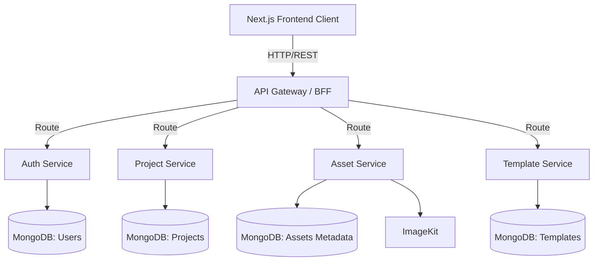

# System Architecture: Design Desk

This document outlines the high-level architecture for Design Desk to guide AI agents and developers.

## 1. Overview
Design Desk is built using a **Microservice Architecture** combined with a **BFF (Backend for Frontend)** pattern. 

## 2. Component Diagram

## 3. Microservices Details

- **Frontend (Next.js):** Handles the UI, state management (Zustand), and the React Konva canvas editor. Written in TypeScript.
- **API Gateway (Express.js or Next.js API Routes):** Acts as a reverse proxy, handling rate limiting, request aggregation, and routing to appropriate microservices.
- **Auth Service (Express.js):** Manages user identities, registration, login, and JWT token issuing.
- **Project Service (Express.js):** Manages design state (saved as serialized React Konva JSON).
- **Asset Service (Express.js):** Handles image uploads from users and fetching system assets (shapes, icons). Uploads files to ImageKit.
- **Template Service (Express.js):** Manages pre-built design templates.

## 4. Database Strategy
- **Database-per-service pattern:** Each microservice has its own logical MongoDB database to ensure loose coupling.
- **No strict referential integrity across services:** E.g., the Project service holds a `userId` as a string/ObjectId but does not strictly "join" with the Users database at the DB level. Data aggregation happens at the API Gateway or Client level.
